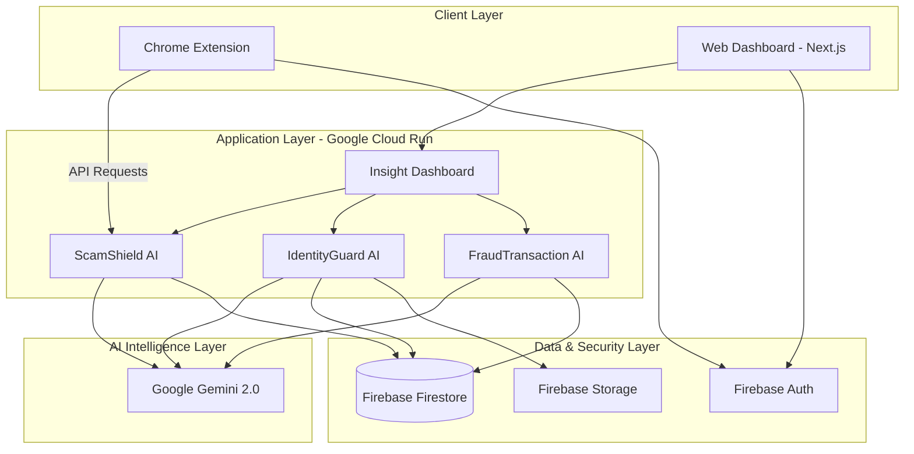

# FinTrust AI: Intelligent Fintech Security Platform 🛡️

**FinTrust AI** is a centralized fintech security ecosystem designed to provide multi-layered protection against digital fraud. By leveraging the **Google AI Ecosystem Stack**, the platform transitions from simple scam detection to autonomous security intelligence, specifically tailored for the Malaysian and Southeast Asian financial landscape.

## 🏗️ Architectural Overview

FinTrust AI is a modular intelligence hub that aggregates data from specialized security modules into a unified **Insight Dashboard**, providing a "Single Source of Truth" for fintech security.

### Core Modules

1.  **ScamShield AI (NLP Reasoning):** Uses Gemini 2.0 to detect scam intent in text/URLs and identifies "Quishing" (QR scams).
2.  **IdentityGuard AI (Vision Intelligence):** A digital risk analyzer using Gemini Vision for face verification and document authenticity analysis to prevent deepfakes and identity theft.
3.  **FraudTransaction (Pattern Analysis):** Uses AI to detect fraudulent transaction patterns and flag high-risk anomalies in real-time.

## 🛠️ The "Build With AI" Tech Stack

*   **Frontend:** Next.js (App Router), TypeScript, Tailwind CSS.
*   **Backend:** Firebase Firestore (Storage), Firebase Auth (Security), Next.js API Routes (Logic).
*   **AI Layer:** Google Gemini 2.0 (NLP Reasoning, Vision Intelligence, and AI Summarization).
*   **Chrome Extension:** Real-time web protection using Manifest V3 and Shadow DOM.
*   **Deployment:** Fully containerized and deployed on Google Cloud Run.

## 🚀 Key Features

### 1. ScamShield AI & Chrome Extension
*   **Real-time Analysis:** Analyze suspicious texts, URLs, and emails with one click.
*   **Intent Detection:** Distinguish between legitimate marketing and malicious social engineering.
*   **Quishing Protection:** Vision-based scanning for malicious QR code redirects.
*   **Unified Logging:** All threats detected via the extension are persisted to the central dashboard.

### 2. IdentityGuard AI
*   **Deepfake Detection:** Analyze facial frames to calculate liveness and synthetic probability.
*   **Document Verification:** Automated authenticity analysis for ID documents.
*   **Forensic Registry:** Detailed audit logs for every identity verification attempt.

### 3. FraudTransaction Monitoring
*   **Behavioral Baselining:** Identifies anomalies based on established spending patterns.
*   **Investigation Mode:** Specialized UI for security analysts to deep-dive into suspicious transaction chains.

## 📈 Impact & Strategic Alignment

*   **Actionable Intelligence:** Transitions security from passive alerts to actionable insights through risk scoring.
*   **Malaysian Context:** Specifically optimized for local fraud patterns (Mule accounts, e-wallet phishing).
*   **National Security:** Addresses the "Secure Digital" challenge by protecting citizens from multi-million dollar annual losses.

## 🛡️ Responsible AI & Security

*   **Privacy First:** PII is encrypted at rest in Firestore.
*   **Reasoning Path:** AI-generated risk scores include a detailed explanation of the underlying logic for transparency.
*   **Ethical Alignment:** Adheres to Google’s AI Principles for unbiased risk assessment.

---
**Developed for Project 2030 by Group Alfred_67**
